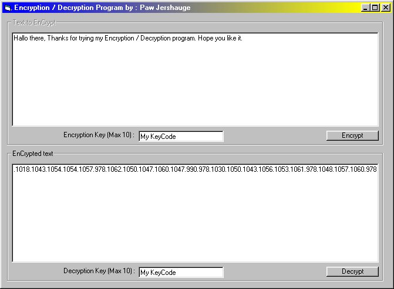



## A Encryption/Decryption Program

### Description

This program encrypt or decrypt a text, with a key and a checksum checker. Very good program
 
### More Info
 

             |
---                |---
**Submitted On**   |2000-09-11 04:12:44
**By**             |[Paw Jershauge](https://github.com/Planet-Source-Code/PSCIndex/blob/master/ByAuthor/paw-jershauge.md)
**Level**          |Advanced
**User Rating**    |4.0 (16 globes from 4 users)
**Compatibility**  |VB 5\.0, VB 6\.0
**Category**       |[String Manipulation](https://github.com/Planet-Source-Code/PSCIndex/blob/master/ByCategory/string-manipulation__1-5.md)
**World**          |[Visual Basic](https://github.com/Planet-Source-Code/PSCIndex/blob/master/ByWorld/visual-basic.md)
**Archive File**   |[CODE\_UPLOAD98089102000\.zip](https://github.com/Planet-Source-Code/paw-jershauge-a-encryption-decryption-program__1-11400/archive/master.zip)

